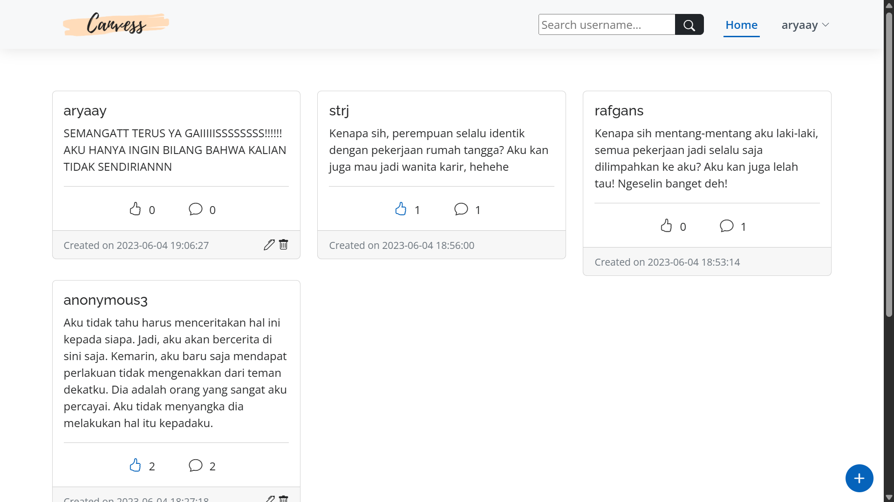
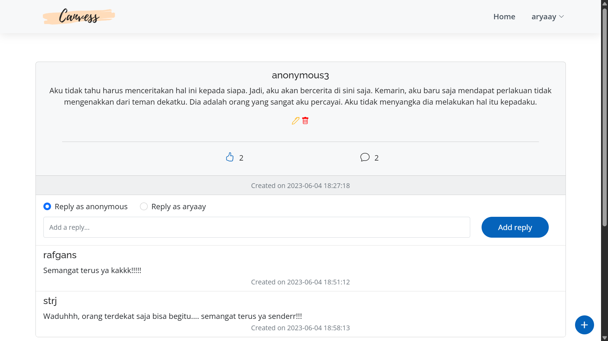
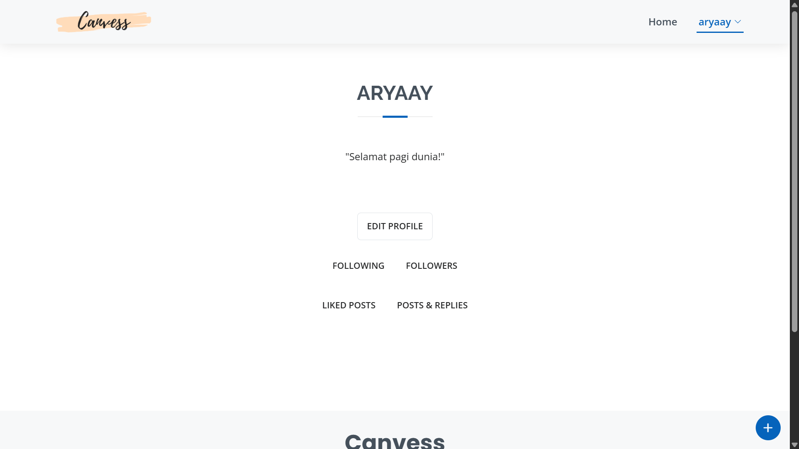
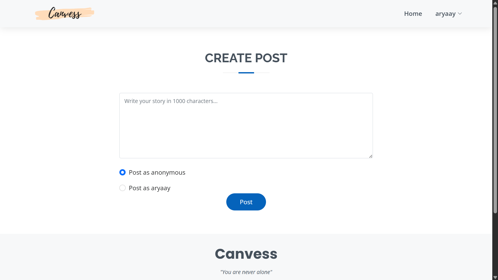
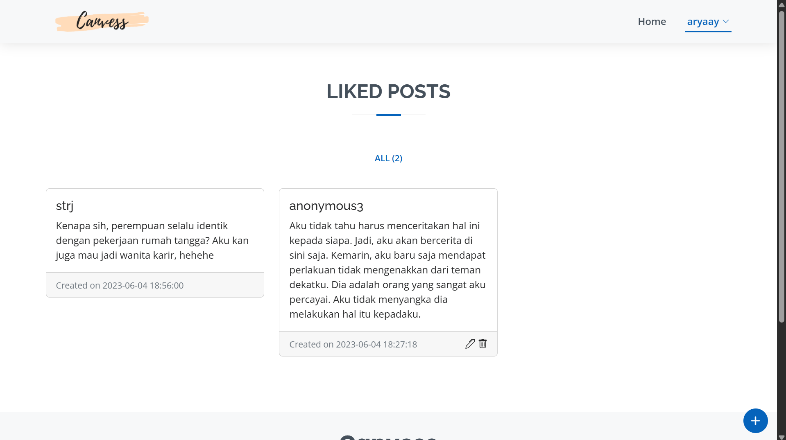
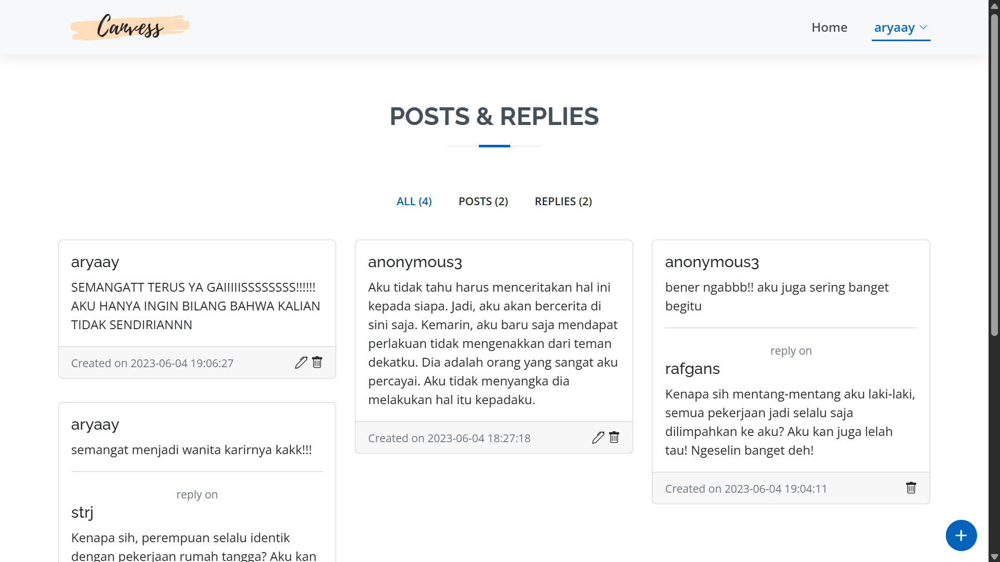

# Canvess

Canvess is a web app that allows user to confess their deepest secrets anonymously. The concept of the app itself is inspired by X (formerly Twitter), but users can hide their identity or, in other words, become anonymous when posting. Features include posting, replying, liking posts, editing profile and following other users. This app is a group project to complete the final task for Database System course.

## Preview

Below is a preview of canvess.

## Authors

- Arya Aydin Margono
- Muhammad Rafie Alhabsyi Setiawan
- Siti Rija Dana Prima
